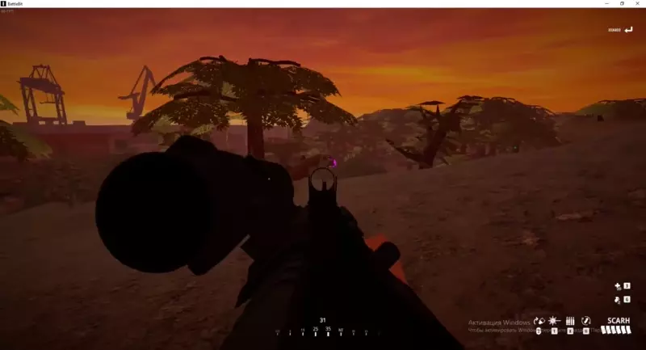

# BattleBitHack

First expreince in modding **Unity** games, started with using `Mono Injection` method in `BattleBit Remastered` game.

`25.12.2021` - game becomes compiled with **il2cpp** mode and there is no longer way to use mono injection (at least with method that I've tried) :cry:

Due to the reason above this is deprecated nowadays and serves for educational purposes.

## Features
- Basic esp
- Universal magenta unity chams
- Free flight camera
- No recoil is showcased in the video but it is a part of other project
- Hierarchy menu:
- - Disable weather effects and increase fps 📈
- - Scene dumper

## Showcase
<table>
  <tr>
    <td>
      
    </td>
  </tr>
</table>
